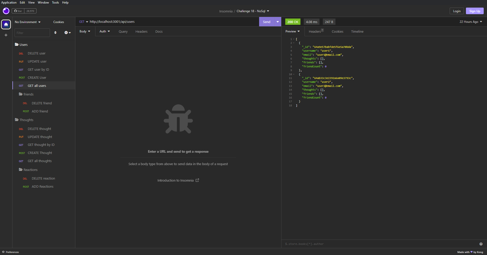

# NoSQL - Social Network API

MongoDB is a popular choice for many social networks due to its speed with large amounts of data and flexibility with unstructured data. Over the last part of this course, you’ll use several of the technologies that social networking platforms use in their full-stack applications. Because the foundation of these applications is data, it’s important that you understand how to build and structure the API first.

## Table of Contents
  * [Installation](#installation)
  * [Usage](#usage)  
  * [License](#license)
  * [Contributing](#contributing)  
  * [Questions](#questions)

## Installation

To install this app you will need to clone the repository from github (link bellow). Once you clone the app make sure to run on the terminal "npm install", "npm install express" as well as "npm install mongoose".

https://github.com/renansm93/NoSQL__Social-Network-API

## Usage

To run the program, run the code according to the video bellow:

[Click me to see the demo video!](https://drive.google.com/file/d/19kPlHCJs_uMvfAXjDrZ3cMc6X7jv-yEU/view?usp=sharing)

## License

This application is covered by the  

## Contributing

* renansm93
* Any improvements or advice are always welcome.

## Questions

[Email me](mailto:rs.miranda93@gmail.com)

[Review my other projects on GitHub.](https://www.github.com/renansm93)